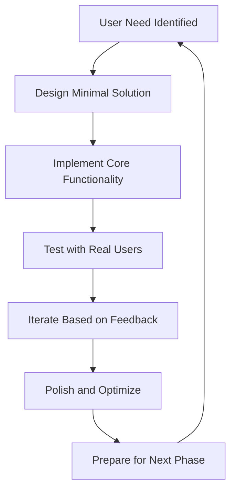

# Iterative Development Plan - Tauri Markdown Editor

> **Complete development roadmap from barebones setup to enterprise-ready markdown editor, progressing through functional products that each build on the previous phase.**

## Development Philosophy

This iterative development plan follows the principle of **functional progression** - each phase results in a working, potentially shippable product that delivers real value while laying the foundation for the next phase. Rather than building features in isolation, we build complete experiences that users can benefit from immediately.

### Core Principles
- **Working Software First:** Every phase produces a functional application
- **Incremental Value:** Each phase adds meaningful value over the previous
- **User-Centric Development:** Features are developed based on real user workflows
- **Technical Excellence:** Quality and architecture improve with each iteration
- **Sustainable Growth:** Each phase supports the complexity of future phases

## Phase Overview

| Phase | Duration | Status | Primary Value | User Experience |
|-------|----------|--------|---------------|-----------------|
| [Phase 0](#phase-0-setup) | 3-5 days | Foundation | Development environment | App opens, basic UI visible |
| [Phase 1](#phase-1-mvp) | 1-2 weeks | MVP | Core markdown editing | Usable markdown editor |
| [Phase 2](#phase-2-enhancement) | 1-2 weeks | Enhanced | Improved workflow | Professional editing experience |
| [Phase 3](#phase-3-advanced) | 2-3 weeks | Advanced | Rich content creation | Notion-like editing capabilities |
| [Phase 4](#phase-4-polish) | 1-2 weeks | Production-Ready | Professional polish | Commercial-grade application |
| [Phase 5](#phase-5-scalability) | 2-3 weeks | Enterprise-Ready | Power user features | Enterprise documentation platform |

**Total Timeline:** 8-12 weeks (2-3 months)

## Phase Details

### Phase 0: Setup - Barebones Application
**🎯 Goal:** Establish foundation and development environment

**Key Deliverables:**
- Working Tauri application that builds and runs
- Basic React frontend with Tailwind styling
- Rust backend with command communication
- Development tooling and hot reload
- Empty UI structure (sidebar + main area)

**Success Criteria:**
- App starts without errors
- Development environment is productive
- Team can contribute effectively
- Basic cross-platform compatibility

[📖 Read Full Phase 0 Documentation](./phase-0-setup.md)

---

### Phase 1: MVP - Core Functionality
**🎯 Goal:** Deliver minimal but complete markdown editing experience

**Key Deliverables:**
- Folder selection and file browsing
- Basic text editor with markdown syntax highlighting
- File operations (create, save, rename, delete)
- Auto-save functionality
- Search and filtering
- Basic settings and preferences

**Success Criteria:**
- Users can select a folder and edit markdown files
- All core file operations work reliably
- Auto-save prevents data loss
- Search helps users find files quickly
- Settings persist between sessions

**Target Users:** Individual users who need a reliable markdown editor

[📖 Read Full Phase 1 Documentation](./phase-1-mvp.md)

---

### Phase 2: Enhancement - Improved UX & Workflow
**🎯 Goal:** Transform MVP into polished, efficient editing tool

**Key Deliverables:**
- Tabbed interface for multiple open files
- File watching and external change detection
- Advanced file operations (copy, move, batch actions)
- Enhanced editor with better markdown support
- Global search across all files
- Comprehensive keyboard shortcuts

**Success Criteria:**
- Multiple file editing feels seamless
- File changes are detected and handled gracefully
- Search finds content across entire workspace
- Keyboard shortcuts enable power user workflows
- Performance remains excellent with many files

**Target Users:** Regular users who work with multiple markdown files

[📖 Read Full Phase 2 Documentation](./phase-2-enhancement.md)

---

### Phase 3: Advanced Features - Rich Editing & WYSIWYG
**🎯 Goal:** Compete with modern rich text editors like Notion

**Key Deliverables:**
- Tiptap-based WYSIWYG editor
- Block-based content system
- Advanced table editing with CSV import/export
- Rich media support (images, embeds, math equations)
- Document structure and navigation
- Export capabilities (PDF, HTML, Word)

**Success Criteria:**
- WYSIWYG editing matches markdown output perfectly
- Block-based editing enables flexible content creation
- Rich content (tables, math, diagrams) works seamlessly
- Export generates high-quality output
- Document navigation scales to large files

**Target Users:** Content creators, technical writers, professionals

[📖 Read Full Phase 3 Documentation](./phase-3-advanced.md)

---

### Phase 4: Polish - UI/UX Refinements & Accessibility
**🎯 Goal:** Production-ready application with professional polish

**Key Deliverables:**
- WCAG 2.1 AA accessibility compliance
- Smooth animations and micro-interactions
- Comprehensive error handling
- Performance optimization
- Onboarding and help system
- Advanced UI components and design system

**Success Criteria:**
- Application is fully accessible to users with disabilities
- Interface feels smooth and responsive
- Error handling provides helpful guidance
- Performance benchmarks are consistently met
- New users can become productive quickly

**Target Users:** All users, with focus on accessibility and professional use

[📖 Read Full Phase 4 Documentation](./phase-4-polish.md)

---

### Phase 5: Scalability - Power User Features & Enterprise Capabilities
**🎯 Goal:** Enterprise-ready documentation platform

**Key Deliverables:**
- Multi-workspace management
- Git integration with visual diff
- Plugin system for extensibility
- Automation and workflow features
- Team collaboration tools
- Advanced analytics and insights

**Success Criteria:**
- Supports large-scale documentation projects (1000+ files)
- Git integration enables version control workflows
- Plugin system allows customization
- Collaboration features support team workflows
- Performance scales to enterprise usage

**Target Users:** Power users, teams, enterprise customers

[📖 Read Full Phase 5 Documentation](./phase-5-scalability.md)

## Development Strategy

### Feature Development Approach



### Quality Gates Between Phases

Each phase must meet specific quality criteria before proceeding:

1. **Functionality:** All features work as designed
2. **Stability:** No crashes or data loss under normal usage
3. **Performance:** Meets defined performance benchmarks
4. **User Experience:** User testing confirms value delivery
5. **Technical Quality:** Code quality supports future phases

### Risk Management

**Early Phases (0-2):**
- Focus on solid foundation and core functionality
- Prioritize reliability over features
- Establish development practices and quality standards

**Middle Phases (3-4):**
- Manage feature complexity carefully
- Maintain performance while adding rich functionality
- Balance user needs with technical constraints

**Later Phases (5):**
- Plan for long-term maintainability
- Consider enterprise requirements early
- Prepare for scale and extensibility

## Technology Evolution

### Architecture Progression

**Phase 0-1:** Simple React + Tauri application
- Basic component structure
- Simple state management
- Direct Rust command calls

**Phase 2-3:** Structured application with advanced features
- Component architecture with hooks
- Sophisticated state management
- Service layer for business logic

**Phase 4-5:** Enterprise-ready architecture
- Plugin system and extensibility
- Performance optimization
- Comprehensive error handling

### Dependency Management

```typescript
// Dependency introduction by phase
const dependencyTimeline = {
  phase0: ['react', 'tailwindcss', '@tauri-apps/api'],
  phase1: ['react-markdown', 'fuse.js', 'codemirror'],
  phase2: ['react-hotkeys-hook', 'react-window', 'lodash.debounce'],
  phase3: ['@tiptap/react', 'katex', 'mermaid', 'jspdf'],
  phase4: ['framer-motion', 'react-spring', 'react-virtualized'],
  phase5: ['monaco-editor', 'simple-git', 'socket.io-client']
};
```

## Success Metrics by Phase

### Phase 0-1: Foundation Metrics
- **Build Success:** 100% successful builds across platforms
- **Development Velocity:** Features implemented within estimated time
- **User Satisfaction:** Early users can complete basic editing tasks

### Phase 2-3: Feature Metrics
- **Feature Adoption:** Users regularly use advanced features
- **Performance:** Application remains responsive with complex content
- **User Retention:** Users prefer the application over alternatives

### Phase 4-5: Production Metrics
- **Reliability:** <0.1% crash rate in production
- **Accessibility:** 100% WCAG compliance
- **Enterprise Adoption:** Successful enterprise deployments

## Risk Mitigation Strategies

### Technical Risks
- **Performance Degradation:** Continuous performance monitoring and optimization
- **Feature Complexity:** Incremental feature development with user testing
- **Cross-Platform Issues:** Regular testing on all target platforms

### Product Risks
- **Market Fit:** Continuous user feedback and iteration
- **Feature Creep:** Strict phase boundaries and success criteria
- **User Experience:** Design system and usability testing

### Business Risks
- **Timeline Overrun:** Buffer time in estimates and flexible scope
- **Resource Constraints:** Prioritized feature development
- **Competition:** Unique value proposition and rapid iteration

## Getting Started

### Prerequisites
- Node.js 18+ and Rust toolchain
- Development environment setup (VS Code recommended)
- Basic familiarity with React, TypeScript, and Tauri

### Development Workflow
1. **Clone Repository:** Start with project template
2. **Phase Planning:** Review current phase requirements
3. **Feature Development:** Follow phase-specific guidelines
4. **Quality Assurance:** Meet phase exit criteria
5. **User Testing:** Validate with real users
6. **Phase Completion:** Document and transition to next phase

### Contributing
Each phase has specific contribution guidelines and coding standards. Review the phase-specific documentation before beginning development.

---

## Conclusion

This iterative development plan transforms a simple idea into a comprehensive, enterprise-ready application through systematic, user-focused development. Each phase builds meaningful value while preparing for future complexity, ensuring both immediate user satisfaction and long-term success.

**Next Steps:**
1. Review [Phase 0 Setup](./phase-0-setup.md) to begin development
2. Set up development environment following setup documentation
3. Begin iterative development with regular user feedback
4. Track progress against phase-specific success criteria

The journey from barebones setup to enterprise platform is ambitious but achievable through disciplined, iterative development that prioritizes user value at every step. 